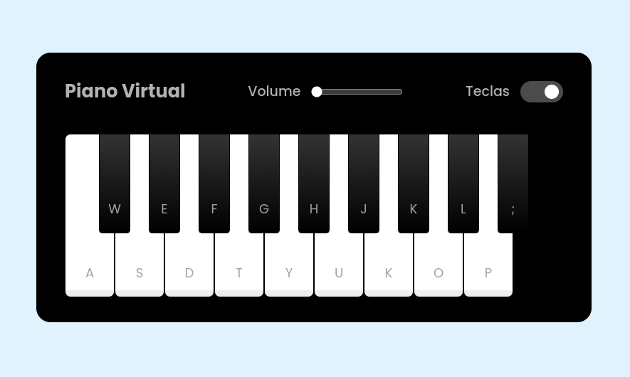

<h1 align="center">Piano Virtual</h1>

  
  

  

## 🎹 Projeto

- Criando um Piano Virtual com `html`, `css` e `javascript`.

- Projeto para praticar manipulação de html e css através do javascript.

## Conceito e pratica 

- Manipulação de DOM
- Tratamento de elementos HTML
- Adicionar e remover classes dinamicamente
- Toggle com classes
- Event Listeners
- Estlização de componentes com CSS
- Pseudo elementos (Before | After)
